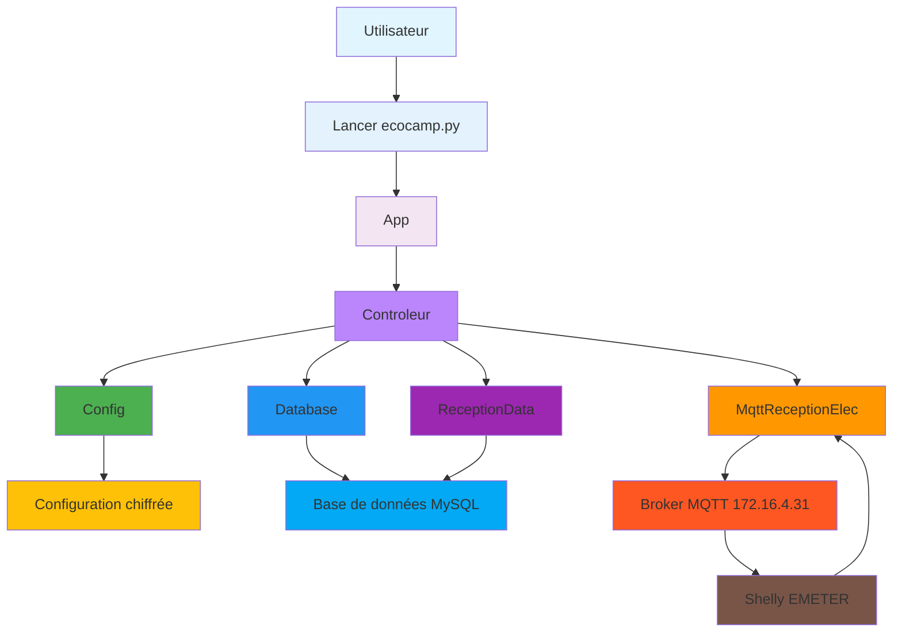
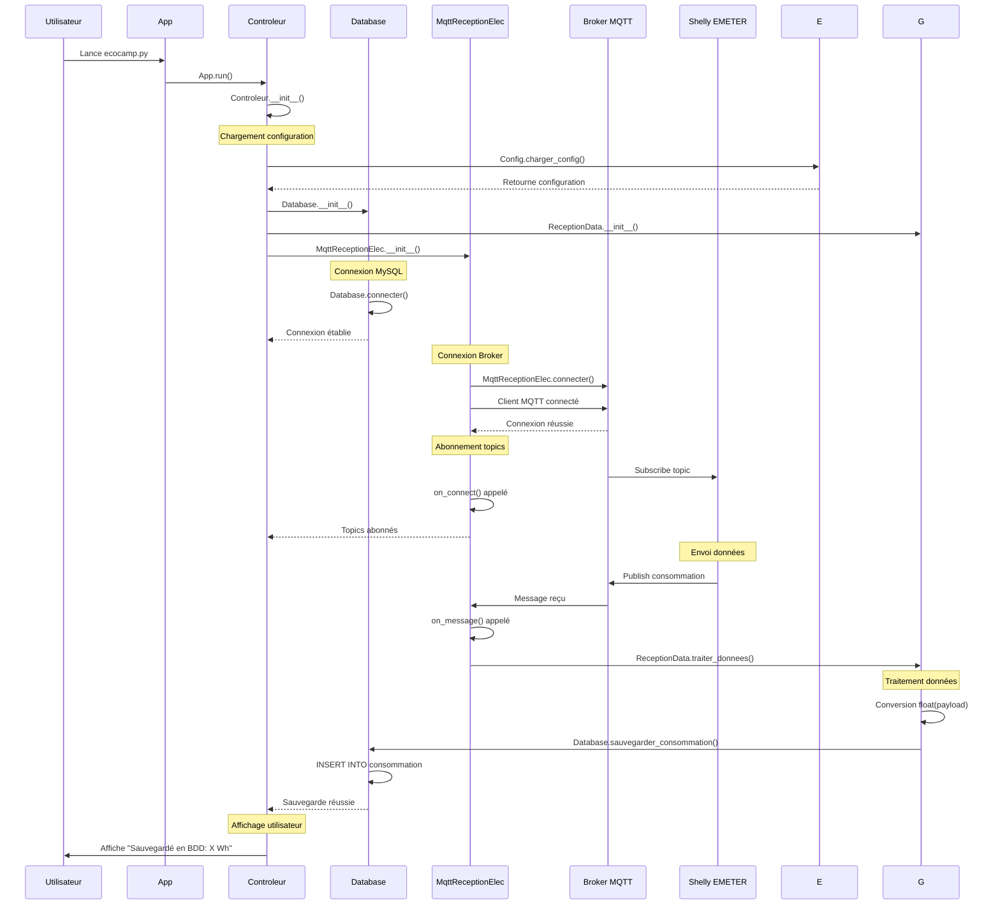

# Diagramme de séquence - Projet Electricité EcoCamp

## Vue d'ensemble



## Flux de données principal



## Architecture technique

### 1. Structure des fichiers

```
ecocamp.py                     # Point d'entrée (18 lignes)
├── config_simple.py            # Configuration simple
├── test_app.py                # Classe App + test
├── test_config.py             # Classe Config + test
├── test_database.py           # Classe Database + test
├── test_reception_data.py     # Classe ReceptionData + test
├── test_mqtt.py              # Classe MqttReceptionElec + test
├── test_controleur.py        # Classe Controleur + test
└── core/                      # Outils configuration
    ├── encrypt_config.py        # Chiffrement configuration
    └── generate_key.py         # Génération clés
```

### 2. Flux d'exécution

1. **Démarrage** : `ecocamp.py` → `App.run()`
2. **Initialisation** : `Controleur.__init__()` charge toutes les classes
3. **Connexions** : Tests BDD + MQTT en parallèle
4. **Abonnement** : MQTT s'abonne au topic Shelly
5. **Écoute** : Boucle infinie d'écoute MQTT
6. **Réception** : Shelly envoie `26883.6`
7. **Traitement** : Conversion et sauvegarde BDD
8. **Affichage** : Message de confirmation utilisateur

### 3. Base de données

```sql
CREATE TABLE consommation (
    id_consommation VARCHAR(50) PRIMARY KEY,
    id_hebergement INT,
    id_sejour INT,
    id_type_flux INT,
    date_sauvegarde TIMESTAMP
);
```

### 4. Configuration

```json
{
    "mqtt": {
        "broker": "172.16.4.31",
        "port": 1883,
        "topics": ["shellies/34945474526B/emeter/0/total"]
    },
    "db": {
        "host": "172.16.4.102",
        "user": "ecocamp",
        "password": "ecocamp2026",
        "database": "ecocamp",
        "port": 3306
    },
    "id_hebergement": 10
}
```

### 5. Messages MQTT

**Topic** : `shellies/34945474526B/emeter/0/total`  
**Payload** : `"26883.6"` (consommation en Wh)  
**Fréquence** : Toutes les 30 secondes environ

### 6. Gestion des erreurs

- **UnicodeDecodeError** : Messages non-texte ignorés
- **struct.error** : Erreurs MQTT gérées
- **KeyError** : Configuration manquante
- **ConnectionError** : Problèmes réseau/BDD

### 7. Sécurité

- **Configuration chiffrée** : Fernet + sel
- **Clés séparées** : secret.key + salt.key
- **INSERT IGNORE** : Évite doublons BDD

### 8. Points d'entrée

- **Développement** : Tests unitaires dans chaque `test_xxx.py`
- **Production** : Lancement via `ecocamp.py`
- **Monitoring** : Logs console minimalistes

---

*Diagramme généré le 24/03/2026 pour le projet Electricité EcoCamp*
